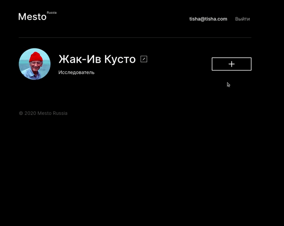
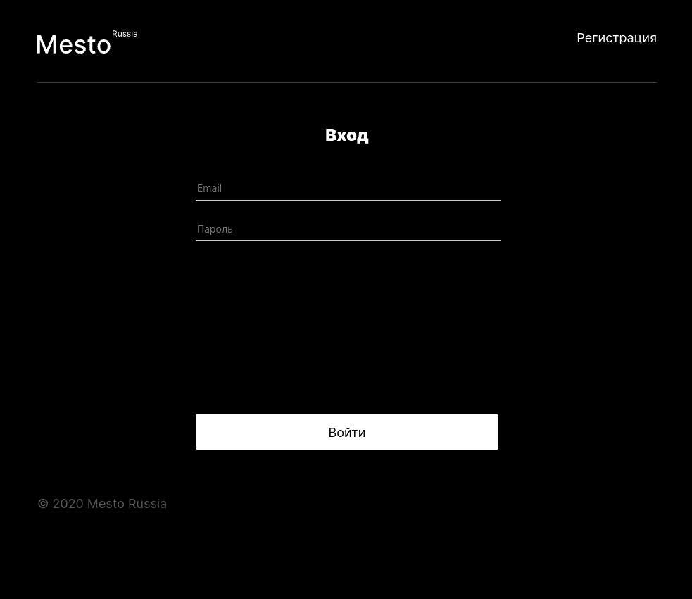
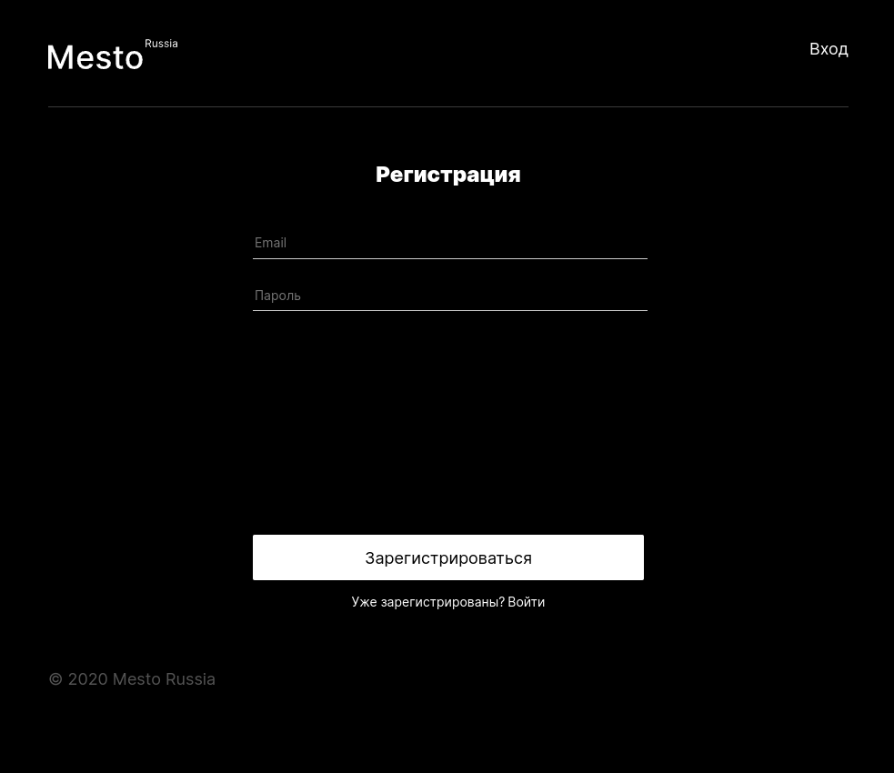
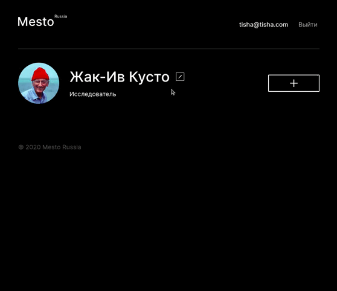

<!-- 

# react-mesto-api-full
Репозиторий для приложения проекта `Mesto`, включающий фронтенд и бэкенд части приложения 
  
Пожалуйста, прикрепите в это описание ссылку на сайт, размещенный на Яндекс.Облаке.

Адрес репозитория: https://github.com/SushaIvanova/react-mesto-api-full-gha.git

## Ссылки на проект

IP 158.160.112.249

Frontend https://yp23.mesto.nomoredomainsicu.ru

Backend https://api.yp23.mesto.nomoredomainsicu.ru -->

<h1 align="center">Mesto</h1>

  

<h2 align="center">
  <a href="https://yp23.mesto.nomoredomainsicu.ru" style="color: black;" target="_blank">🎬Ссылка🎬</a>
</h2>

<h2>Описание проекта</h2>

  Mesto - учебный проект, задачей которого было создание интерактивной страницы, куда можно добавлять фотографии, удалять их и ставить лайки.

  

  Реализованы регистрация и авторизация. 

  
  

  У пользователя есть возможность редактировать информацию профиля и аватар.

  

- Главная страница защищена авторизацией
- Все формы вылидируются
